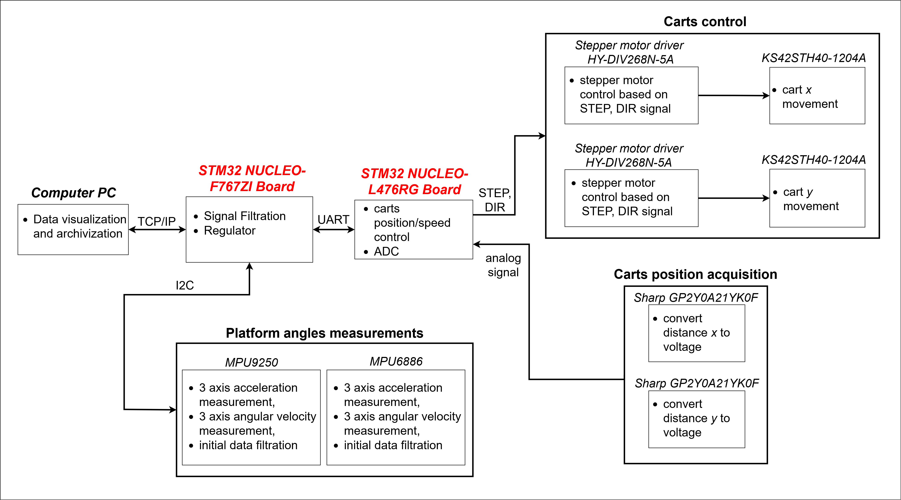

# Transport Platform Control Systen

Control system for platform transport written for my master thesis.

## Description

*Figure 1. Diagram of system* 

---

## Key Features
* Control system
* Vibration reduction
* Carts position/speed control
* Angle control

---

## Files

* Transport Platform system control MCU ([STM32 NUCLEO-F767ZI](https://www.st.com/en/evaluation-tools/nucleo-f767zi.html)):
    * motor_mcu/Core/src/stepper_motor.c -> functions connected with stepper motor and optical sensor
    * motor_mcu/Core/Src/stm32l4xx_it.c -> timer: motor control and ADC data acquisition

* Stepper Motor control MCU ([STM32 NUCLEO-L476RG](https://www.st.com/en/evaluation-tools/nucleo-l476rg.html)):
    * control_mcu/Core/Src/communication.c -> I2C communication
    * control_mcu/Core/Src/accelerometers.c -> MPU9250 and MPU6886 init and read/write data
    * control_mcu/Core/Src/filters.c -> Digital filter implementation:
        * Moving average
        * Complementary
        * Alfa-Beta
        * Kalman
    * control_mcu/Core/Src/control.c -> data storage and platform control
    * control_mcu/Core/Src/tcp_server.c -> TCP server (based on [lwip echo server](https://git.savannah.nongnu.org/cgit/lwip/lwip-contrib.git/tree/apps/tcpecho_raw/tcpecho_raw.c))

---

## Tools used
* [STM32cubeIDE](https://www.st.com/en/development-tools/stm32cubeide.html)

---

## Instalation
* Repository doesn't include HAL library files. In this case it is required to at first generate blank project for each board and then swap *core* files with generated ones.