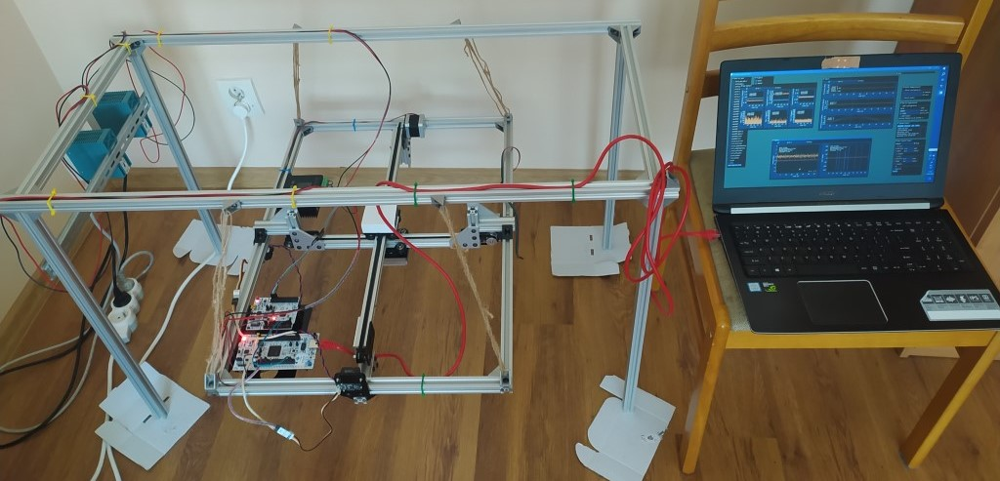

# Transport Platform Control System

Control system for platform transport project written for my master thesis.

## Description

Project of a transport platform with vibration reduction system. Vibration reduction is achieved be controling carts position and speed. 
Orientation of platform is obtained based on data from digital accelerometers/gyroscopes (MPU9250, MPU6886) and filtratration algorithms (e.g. Kalman filter).
Actual carts position is measured by optical sensors (Sharp GP2Y0A21YK0F).
STM32 NUCLEO-L476RG board is used for motors control system. It generaters step/dir signals based on data recieved from control MCU (STM32 NUCLEO-F767ZI board) and position measured by optical sensors.
STM32 NUCLEO-F767ZI board is responsible for: acquiring data from accelerometers/gyroscopes and signal filtration, regulation system, sending steering data to motor control board (STM32 NUCLEO-L476RG board), communication with external PC via Ethernet interface.

*Figure 1. Test stand* 

*Figure 2. Transport Platform* 

*Figure 3. Schematic of system* 

---

## Key Features
* Control system
* Vibration reduction
* Carts position/speed control
* Angle control

---

## Files

* Transport Platform system control MCU ([STM32 NUCLEO-F767ZI](https://www.st.com/en/evaluation-tools/nucleo-f767zi.html)):
    * motor_mcu/Core/src/stepper_motor.c -> functions connected with stepper motor and optical sensor
    * motor_mcu/Core/Src/stm32l4xx_it.c -> timer: motor control and ADC data acquisition

* Stepper Motor control MCU ([STM32 NUCLEO-L476RG](https://www.st.com/en/evaluation-tools/nucleo-l476rg.html)):
    * `control_mcu/Core/Src/communication.c` -> I2C communication
    * `control_mcu/Core/Src/accelerometers.c` -> MPU9250 and MPU6886 init and read/write data
    * `control_mcu/Core/Src/filters.c` -> Digital filter implementation:
        * Moving average
        * Complementary
        * Alfa-Beta
        * Kalman
    * `control_mcu/Core/Src/control.c` -> data storage and platform control
    * `control_mcu/Core/Src/tcp_server.c` -> TCP server (based on [lwip echo server](https://git.savannah.nongnu.org/cgit/lwip/lwip-contrib.git/tree/apps/tcpecho_raw/tcpecho_raw.c))

---

## Tools used
* [STM32cubeIDE](https://www.st.com/en/development-tools/stm32cubeide.html)

---

## Instalation
* Repository doesn't include HAL library files. In this case it is required to at first generate blank project for each board and then swap *core* files with generated ones.
